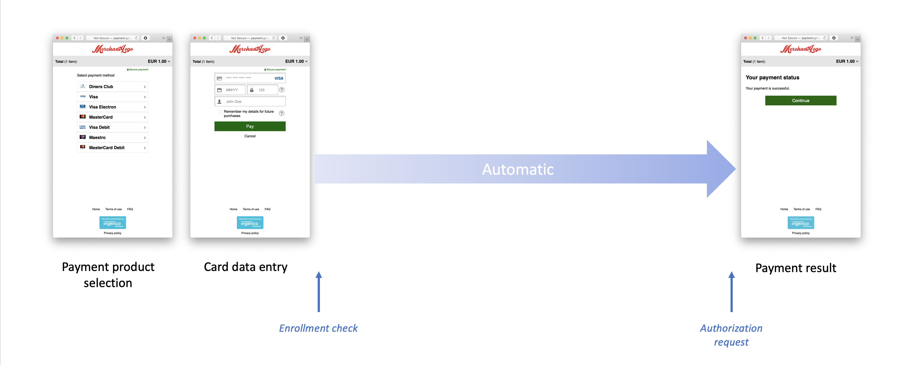

# Citypay Api Client.AuthorisationAndPaymentApi

All URIs are relative to *https://api.citypay.com*

Method | HTTP request | Description
------------- | ------------- | -------------
[**authorisationRequest**](AuthorisationAndPaymentApi.md#authorisationRequest) | **POST** /v6/authorise | Authorisation
[**binRangeLookupRequest**](AuthorisationAndPaymentApi.md#binRangeLookupRequest) | **POST** /v6/bin | Bin Lookup
[**cResRequest**](AuthorisationAndPaymentApi.md#cResRequest) | **POST** /v6/cres | CRes
[**captureRequest**](AuthorisationAndPaymentApi.md#captureRequest) | **POST** /v6/capture | Capture
[**createPaymentIntent**](AuthorisationAndPaymentApi.md#createPaymentIntent) | **POST** /v6/intent/create | Create a Payment Intent
[**paResRequest**](AuthorisationAndPaymentApi.md#paResRequest) | **POST** /v6/pares | PaRes
[**refundRequest**](AuthorisationAndPaymentApi.md#refundRequest) | **POST** /v6/refund | Refund
[**retrievalRequest**](AuthorisationAndPaymentApi.md#retrievalRequest) | **POST** /v6/retrieve | Retrieval
[**voidRequest**](AuthorisationAndPaymentApi.md#voidRequest) | **POST** /v6/void | Void


## authorisationRequest

> Decision authorisationRequest(auth_request)

Authorisation

## Authorization API Overview

The authoriSation process is a critical component in payment processing, enabling standard transaction authoriSation 
based on the parameters provided in its request. The CityPay gateway facilitates this by routing your transaction 
through an Acquiring bank, which then seeks authorisation from the appropriate card schemes, such as Visa or MasterCard.

This API is designed for server environments that require the processing of transactions on demand and in real-time. It 
supports a wide range of transaction types, including E-commerce, mail order, telephone order, customer present (keyed), 
continuous authority, pre-authorisation, and others. CityPay will configure your account for the appropriate acquirer 
coding, ensuring seamless operation through the gateway.

Depending on the payment environment, specific data properties are required. Our API is flexible enough to accommodate 
these requirements, and our integration team is available to assist you in providing the necessary data for transaction 
processing.

### Example JSON Request

```json
{
 "RequestChallenged": {
  "acsurl": "https://bank.com/3DS/ACS",
  "creq": "SXQgd2FzIHRoZSBiZXN0IG9mIHRpbWVzLCBpdCB3YXMgdGhlIHdvcnN00...",
  "merchantid": 12345,
  "transno": 1,
  "threedserver_trans_id": "d652d8d2-d74a-4264-a051-a7862b10d5d6"
 }
}
```

## E-commerce workflows

For E-commerce transactions requiring 3DS, our API includes a fully accredited built-in mechanism to handle 
authentication, simplifying the integration process and eliminating the need for lengthy and costly accreditations with 
Visa and MasterCard.

3D Secure aims to shift the liability of a transaction away from the merchant and back to the cardholder. This 
"liability shift" determines whether a cardholder can charge back a transaction. The process requires the cardholder 
to authenticate the transaction prior to authorisation, producing a Cardholder Verification Value (CAVV) and 
E-commerce Indicator (ECI) as evidence.

3DS version 2 to provide secure customer authentication (SCA) in line with EU regulation.

CityPay support 3DS version 2.2 for Verified by Visa, MasterCard Identity Check and American Express SafeKey 2.2. Version
2.3 is currently in development however this will be a seamless upgrade for all integrations.

#### 3-D Secure - None



Some transactions may not involve 3-D Secure processing, either due to the inability to perform authentication or an 
"attempted" resolution. These transactions may not benefit from a liability shift and could result in a decline.

#### 3-D Secure - Frictionless


3DSv2 supports "frictionless" authentication for low-risk transactions, minimizing impact on the standard 
authorisation flow. This process is handled seamlessly by our API, requiring no redirection and maintaining a smooth 
transaction experience.

#### 3-D Secure - Challenge


Higher-risk transactions may be "challenged," requiring the cardholder to authenticate the transaction. In such cases,  
the API will return a [request challenge](#requestchallenged) which will require your integration to forward the 
cardholder's browser to the given [ACS url](#acsurl). This should be performed by posting the [creq](#creq) value 
(the challenge request value). 

Once complete, the ACS will have already been in touch with our servers by sending us a result of the authentication
known as `RReq`.

To maintain session state, a parameter `threeDSSessionData` can be posted to the ACS url and will be returned alongside 
the `CRes` value. This will ensure that any controller code will be able to isolate state between calls. This field
is to be used by your own systems rather than ours and may be any value which can uniquely identify your cardholder's
session. As an option, we do provide a `threedserver_trans_id` value in the `RequestChallenged` packet which can be used
for the `threeDSSessionData` value as it is used to uniquely identify the 3D-Secure session. 

A common method of maintaining state is to provide a session related query string value in the `merchant_termurl` value
(also known as the `notificationUrl`). For example providing a url of `https://mystore.com/checkout?token=asny2348w4561..`
could return the user directly back to their session with your environment.

Once you have received a `cres` post from the ACS authentication service, this should be POSTed to the [cres](#cres) 
endpoint to perform full authorisation processing. 

Please note that the CRes returned to us is purely a mechanism of acknowledging that transactions should be committed for
authorisation. The ACS by this point will have sent us the verification value (CAVV) to perform a liability shift. The CRes
value will be validated for receipt of the CAVV and subsequently may return response codes illustrating this. 

To forward the user to the ACS, we recommend a simple auto submit HTML form.

> Simple auto submit HTML form

```html
<html lang="en">
<head>
        <title>Forward to ACS</title>
<script type="text/javascript">
        function onLoadEvent() { 
            document.acs.submit(); 
        }
        </script>
        <noscript>You will require JavaScript to be enabled to complete this transaction</noscript>
    </head>
    <body onload="onLoadEvent();">
        <form name="acs" action="{{ACSURL from Response}}" method="POST">
            <input type="hidden" name="creq" value="{{CReq Packet from Response}}" />
            <input type="hidden" name="threeDSSessionData" value="{{session-identifier}}" />
        </form>
    </body>
</html>
```

A full ACS test suite is available for 3DSv2 testing.
        
### Testing 3DSv2 Integrations

The API provides a mock 3dsV2 handler which performs a number of scenarios based on the value of the CSC in the request.

| CSC Value | Behaviour                                                             |
|-----------|-----------------------------------------------------------------------|
| 731       | Frictionless processing - Not authenticated                           |
| 732       | Frictionless processing - Account verification count not be performed |        
| 733       | Frictionless processing - Verification Rejected                       |        
| 741       | Frictionless processing - Attempts Processing                         |        
| 750       | Frictionless processing - Authenticated                               |        
| 761       | Triggers an error message                                             |  
| Any       | Challenge Request                                                     |


### Example

```javascript
import CityPay from 'citypay-api';
let client = new CityPay.ApiClient({
    "sandbox": true,
    "client_id": process.env.CP_CLIENT_ID,
    "licence_key": process.env.CP_LICENCE_KEY
})

let apiInstance = new CityPay.AuthorisationAndPaymentApi();
let auth_request = new CityPay.AuthRequest(); // AuthRequest | 
apiInstance.authorisationRequest(auth_request).then((data) => {
  console.log('API called successfully. Returned data: ' + data);
}, (error) => {
  console.error(error);
});

```

### Parameters


Name | Type | Description  | Notes
------------- | ------------- | ------------- | -------------
 **auth_request** | [**AuthRequest**](AuthRequest.md)|  | 

### Return type

[**Decision**](Decision.md)

### Authorization

[cp-api-key](../README.md#cp-api-key)

### HTTP request headers

- **Content-Type**: application/json, text/xml
- **Accept**: application/json, text/xml


## binRangeLookupRequest

> Bin binRangeLookupRequest(bin_lookup)

Bin Lookup

A bin range lookup service can be used to check what a card is, as seen by the gateway. Each card number's 
leading digits help to identify who

0. the card scheme is such as Visa, MasterCard or American Express 
1. the issuer of the card, such as the bank
2. it's country of origin
3. it's currency of origin

Our gateway has 450 thousand possible bin ranges and uses a number of algorithms to determine the likelihood of the bin
data. The request requires a bin value of between 6 and 12 digits. The more digits provided may ensure a more accurate
result.


### Example

```javascript
import CityPay from 'citypay-api';
let client = new CityPay.ApiClient({
    "sandbox": true,
    "client_id": process.env.CP_CLIENT_ID,
    "licence_key": process.env.CP_LICENCE_KEY
})

let apiInstance = new CityPay.AuthorisationAndPaymentApi();
let bin_lookup = new CityPay.BinLookup(); // BinLookup | 
apiInstance.binRangeLookupRequest(bin_lookup).then((data) => {
  console.log('API called successfully. Returned data: ' + data);
}, (error) => {
  console.error(error);
});

```

### Parameters


Name | Type | Description  | Notes
------------- | ------------- | ------------- | -------------
 **bin_lookup** | [**BinLookup**](BinLookup.md)|  | 

### Return type

[**Bin**](Bin.md)

### Authorization

[cp-api-key](../README.md#cp-api-key)

### HTTP request headers

- **Content-Type**: application/json, text/xml
- **Accept**: application/json, text/xml


## cResRequest

> AuthResponse cResRequest(c_res_auth_request)

CRes

The CRes request performs authorisation processing once a challenge request has been completed
with an Authentication Server (ACS). This challenge response contains confirmation that will
allow the API systems to return an authorisation response based on the result. Our systems will 
know out of band via an `RReq` call by the ACS to notify us if the liability shift has been issued.

Any call to the CRes operation will require a previous authorisation request and cannot be called 
on its own without a previous [request challenge](#requestchallenged) being obtained.


### Example

```javascript
import CityPay from 'citypay-api';
let client = new CityPay.ApiClient({
    "sandbox": true,
    "client_id": process.env.CP_CLIENT_ID,
    "licence_key": process.env.CP_LICENCE_KEY
})

let apiInstance = new CityPay.AuthorisationAndPaymentApi();
let c_res_auth_request = new CityPay.CResAuthRequest(); // CResAuthRequest | 
apiInstance.cResRequest(c_res_auth_request).then((data) => {
  console.log('API called successfully. Returned data: ' + data);
}, (error) => {
  console.error(error);
});

```

### Parameters


Name | Type | Description  | Notes
------------- | ------------- | ------------- | -------------
 **c_res_auth_request** | [**CResAuthRequest**](CResAuthRequest.md)|  | 

### Return type

[**AuthResponse**](AuthResponse.md)

### Authorization

[cp-api-key](../README.md#cp-api-key)

### HTTP request headers

- **Content-Type**: application/json, text/xml
- **Accept**: application/json, text/xml


## captureRequest

> Acknowledgement captureRequest(capture_request)

Capture

_The capture process only applies to transactions which have been pre-authorised only._ 

The capture process will ensure
that a transaction will now settle. It is expected that a capture call will be provided within 3 days or
a maximum of 7 days.

A capture request is provided to confirm that you wish the transaction to be settled. This request can
contain a final amount for the transaction which is different to the original authorisation amount. This
may be useful in a delayed system process such as waiting for stock to be ordered, confirmed, or services
provided before the final cost is known.

When a transaction is completed, a new authorisation code may be created and a new confirmation
can be sent online to the acquiring bank.

Once the transaction has been processed. A standard [`Acknowledgement`](#acknowledgement) will be returned,
outlining the result of the transaction. On a successful completion process, the transaction will
be available for the settlement and completed at the end of the day.


### Example

```javascript
import CityPay from 'citypay-api';
let client = new CityPay.ApiClient({
    "sandbox": true,
    "client_id": process.env.CP_CLIENT_ID,
    "licence_key": process.env.CP_LICENCE_KEY
})

let apiInstance = new CityPay.AuthorisationAndPaymentApi();
let capture_request = new CityPay.CaptureRequest(); // CaptureRequest | 
apiInstance.captureRequest(capture_request).then((data) => {
  console.log('API called successfully. Returned data: ' + data);
}, (error) => {
  console.error(error);
});

```

### Parameters


Name | Type | Description  | Notes
------------- | ------------- | ------------- | -------------
 **capture_request** | [**CaptureRequest**](CaptureRequest.md)|  | 

### Return type

[**Acknowledgement**](Acknowledgement.md)

### Authorization

[cp-api-key](../README.md#cp-api-key)

### HTTP request headers

- **Content-Type**: application/json, text/xml
- **Accept**: application/json, text/xml


## createPaymentIntent

> PaymentIntentReference createPaymentIntent(payment_intent)

Create a Payment Intent

This endpoint initiates the creation of a payment intent, which is a precursor to processing a payment. A payment intent
captures the details of a prospective payment transaction, including the payment amount, currency, and associated
billing and shipping information.


### Example

```javascript
import CityPay from 'citypay-api';
let client = new CityPay.ApiClient({
    "sandbox": true,
    "client_id": process.env.CP_CLIENT_ID,
    "licence_key": process.env.CP_LICENCE_KEY
})

let apiInstance = new CityPay.AuthorisationAndPaymentApi();
let payment_intent = new CityPay.PaymentIntent(); // PaymentIntent | 
apiInstance.createPaymentIntent(payment_intent).then((data) => {
  console.log('API called successfully. Returned data: ' + data);
}, (error) => {
  console.error(error);
});

```

### Parameters


Name | Type | Description  | Notes
------------- | ------------- | ------------- | -------------
 **payment_intent** | [**PaymentIntent**](PaymentIntent.md)|  | 

### Return type

[**PaymentIntentReference**](PaymentIntentReference.md)

### Authorization

[cp-api-key](../README.md#cp-api-key)

### HTTP request headers

- **Content-Type**: application/json, text/xml
- **Accept**: application/json, text/xml


## paResRequest

> AuthResponse paResRequest(pa_res_auth_request)

PaRes

The Payer Authentication Response (PaRes) is an operation after the result of authentication 
 being performed. The request uses an encoded packet of authentication data to 
notify us of the completion of the liability shift. Once this value has been unpacked and its
signature is checked, our systems will proceed to authorisation processing.  

Any call to the PaRes operation will require a previous authorisation request and cannot be called 
on its own without a previous [authentication required](#authenticationrequired)  being obtained.


### Example

```javascript
import CityPay from 'citypay-api';
let client = new CityPay.ApiClient({
    "sandbox": true,
    "client_id": process.env.CP_CLIENT_ID,
    "licence_key": process.env.CP_LICENCE_KEY
})

let apiInstance = new CityPay.AuthorisationAndPaymentApi();
let pa_res_auth_request = new CityPay.PaResAuthRequest(); // PaResAuthRequest | 
apiInstance.paResRequest(pa_res_auth_request).then((data) => {
  console.log('API called successfully. Returned data: ' + data);
}, (error) => {
  console.error(error);
});

```

### Parameters


Name | Type | Description  | Notes
------------- | ------------- | ------------- | -------------
 **pa_res_auth_request** | [**PaResAuthRequest**](PaResAuthRequest.md)|  | 

### Return type

[**AuthResponse**](AuthResponse.md)

### Authorization

[cp-api-key](../README.md#cp-api-key)

### HTTP request headers

- **Content-Type**: application/json, text/xml
- **Accept**: application/json, text/xml


## refundRequest

> AuthResponse refundRequest(refund_request)

Refund

A refund request which allows for the refunding of a previous transaction up 
and to the amount of the original sale. A refund will be performed against the 
original card used to process the transaction.


### Example

```javascript
import CityPay from 'citypay-api';
let client = new CityPay.ApiClient({
    "sandbox": true,
    "client_id": process.env.CP_CLIENT_ID,
    "licence_key": process.env.CP_LICENCE_KEY
})

let apiInstance = new CityPay.AuthorisationAndPaymentApi();
let refund_request = new CityPay.RefundRequest(); // RefundRequest | 
apiInstance.refundRequest(refund_request).then((data) => {
  console.log('API called successfully. Returned data: ' + data);
}, (error) => {
  console.error(error);
});

```

### Parameters


Name | Type | Description  | Notes
------------- | ------------- | ------------- | -------------
 **refund_request** | [**RefundRequest**](RefundRequest.md)|  | 

### Return type

[**AuthResponse**](AuthResponse.md)

### Authorization

[cp-api-key](../README.md#cp-api-key)

### HTTP request headers

- **Content-Type**: application/json, text/xml
- **Accept**: application/json, text/xml


## retrievalRequest

> AuthReferences retrievalRequest(retrieve_request)

Retrieval

A retrieval request which allows an integration to obtain the result of a transaction processed
in the last 90 days. The request allows for retrieval based on the identifier or transaction 
number. 

The process may return multiple results in particular where a transaction was processed multiple
times against the same identifier. This can happen if errors were first received. The API therefore
returns up to the first 5 transactions in the latest date time order.

It is not intended for this operation to be a replacement for reporting and only allows for base transaction
information to be returned.


### Example

```javascript
import CityPay from 'citypay-api';
let client = new CityPay.ApiClient({
    "sandbox": true,
    "client_id": process.env.CP_CLIENT_ID,
    "licence_key": process.env.CP_LICENCE_KEY
})

let apiInstance = new CityPay.AuthorisationAndPaymentApi();
let retrieve_request = new CityPay.RetrieveRequest(); // RetrieveRequest | 
apiInstance.retrievalRequest(retrieve_request).then((data) => {
  console.log('API called successfully. Returned data: ' + data);
}, (error) => {
  console.error(error);
});

```

### Parameters


Name | Type | Description  | Notes
------------- | ------------- | ------------- | -------------
 **retrieve_request** | [**RetrieveRequest**](RetrieveRequest.md)|  | 

### Return type

[**AuthReferences**](AuthReferences.md)

### Authorization

[cp-api-key](../README.md#cp-api-key)

### HTTP request headers

- **Content-Type**: application/json, text/xml
- **Accept**: application/json, text/xml


## voidRequest

> Acknowledgement voidRequest(void_request)

Void

_The void process generally applies to transactions which have been pre-authorised only however voids can occur 
on the same day if performed before batching and settlement._ 

The void process will ensure that a transaction will now settle. It is expected that a void call will be 
provided on the same day before batching and settlement or within 3 days or within a maximum of 7 days.

Once the transaction has been processed as a void, an [`Acknowledgement`](#acknowledgement) will be returned,
outlining the result of the transaction.


### Example

```javascript
import CityPay from 'citypay-api';
let client = new CityPay.ApiClient({
    "sandbox": true,
    "client_id": process.env.CP_CLIENT_ID,
    "licence_key": process.env.CP_LICENCE_KEY
})

let apiInstance = new CityPay.AuthorisationAndPaymentApi();
let void_request = new CityPay.VoidRequest(); // VoidRequest | 
apiInstance.voidRequest(void_request).then((data) => {
  console.log('API called successfully. Returned data: ' + data);
}, (error) => {
  console.error(error);
});

```

### Parameters


Name | Type | Description  | Notes
------------- | ------------- | ------------- | -------------
 **void_request** | [**VoidRequest**](VoidRequest.md)|  | 

### Return type

[**Acknowledgement**](Acknowledgement.md)

### Authorization

[cp-api-key](../README.md#cp-api-key)

### HTTP request headers

- **Content-Type**: application/json, text/xml
- **Accept**: application/json, text/xml

