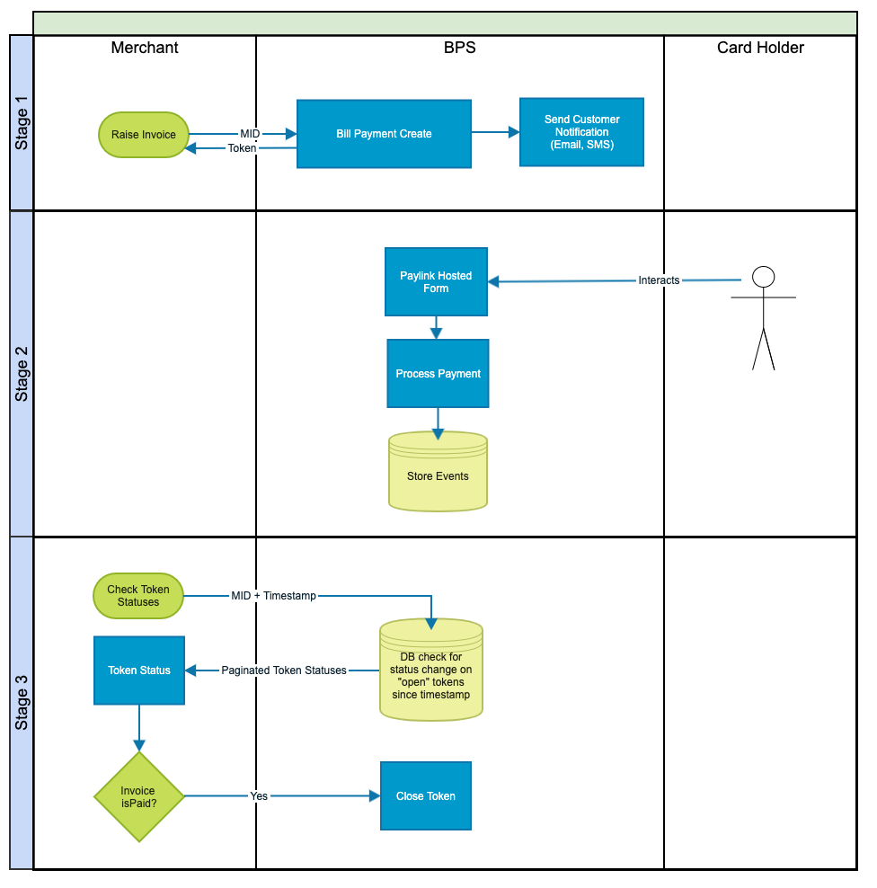
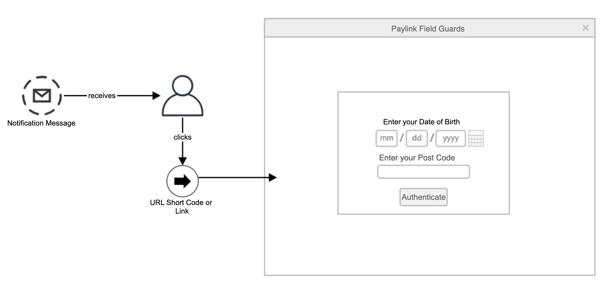

# Citypay Api Client.PaylinkApi

All URIs are relative to *https://api.citypay.com*

Method | HTTP request | Description
------------- | ------------- | -------------
[**tokenAdjustmentRequest**](PaylinkApi.md#tokenAdjustmentRequest) | **POST** /paylink/{token}/adjustment | Paylink Token Adjustment
[**tokenChangesRequest**](PaylinkApi.md#tokenChangesRequest) | **POST** /paylink/token/changes | Paylink Token Audit
[**tokenCloseRequest**](PaylinkApi.md#tokenCloseRequest) | **PUT** /paylink/{token}/close | Close Paylink Token
[**tokenCreateBillPaymentRequest**](PaylinkApi.md#tokenCreateBillPaymentRequest) | **POST** /paylink/bill-payment | Create Bill Payment Paylink Token
[**tokenCreateRequest**](PaylinkApi.md#tokenCreateRequest) | **POST** /paylink/create | Create Paylink Token
[**tokenPurgeAttachmentsRequest**](PaylinkApi.md#tokenPurgeAttachmentsRequest) | **PUT** /paylink/{token}/purge-attachments | Purges any attachments for a Paylink Token
[**tokenReconciledRequest**](PaylinkApi.md#tokenReconciledRequest) | **PUT** /paylink/{token}/reconciled | Reconcile Paylink Token
[**tokenReopenRequest**](PaylinkApi.md#tokenReopenRequest) | **PUT** /paylink/{token}/reopen | Reopen Paylink Token
[**tokenStatusRequest**](PaylinkApi.md#tokenStatusRequest) | **GET** /paylink/{token}/status | Paylink Token Status


## tokenAdjustmentRequest

> Acknowledgement tokenAdjustmentRequest(token, paylink_adjustment_request)

Paylink Token Adjustment

Adjusts a TokenRequest's amount value when for instance 

1. a Token is created and the shopping cart is updated
2. an invoice is adjusted either due to part payment or due to increased incurred costs.


### Example

```javascript
import CityPay from 'citypay-api';
let client = new CityPay.ApiClient({
    "sandbox": true,
    "client_id": process.env.CP_CLIENT_ID,
    "licence_key": process.env.CP_LICENCE_KEY
})

let apiInstance = new CityPay.PaylinkApi();
let token = "token_example"; // String | The token returned by the create token process.
let paylink_adjustment_request = new CityPay.PaylinkAdjustmentRequest(); // PaylinkAdjustmentRequest | 
apiInstance.tokenAdjustmentRequest(token, paylink_adjustment_request).then((data) => {
  console.log('API called successfully. Returned data: ' + data);
}, (error) => {
  console.error(error);
});

```

### Parameters


Name | Type | Description  | Notes
------------- | ------------- | ------------- | -------------
 **token** | **String**| The token returned by the create token process. | 
 **paylink_adjustment_request** | [**PaylinkAdjustmentRequest**](PaylinkAdjustmentRequest.md)|  | 

### Return type

[**Acknowledgement**](Acknowledgement.md)

### Authorization

[cp-api-key](../README.md#cp-api-key)

### HTTP request headers

- **Content-Type**: application/json, text/xml
- **Accept**: application/json, text/xml


## tokenChangesRequest

> PaylinkTokenStatusChangeResponse tokenChangesRequest(paylink_token_status_change_request)

Paylink Token Audit

Allows for the changes to a pre-existing token.

### Example

```javascript
import CityPay from 'citypay-api';
let client = new CityPay.ApiClient({
    "sandbox": true,
    "client_id": process.env.CP_CLIENT_ID,
    "licence_key": process.env.CP_LICENCE_KEY
})

let apiInstance = new CityPay.PaylinkApi();
let paylink_token_status_change_request = new CityPay.PaylinkTokenStatusChangeRequest(); // PaylinkTokenStatusChangeRequest | 
apiInstance.tokenChangesRequest(paylink_token_status_change_request).then((data) => {
  console.log('API called successfully. Returned data: ' + data);
}, (error) => {
  console.error(error);
});

```

### Parameters


Name | Type | Description  | Notes
------------- | ------------- | ------------- | -------------
 **paylink_token_status_change_request** | [**PaylinkTokenStatusChangeRequest**](PaylinkTokenStatusChangeRequest.md)|  | 

### Return type

[**PaylinkTokenStatusChangeResponse**](PaylinkTokenStatusChangeResponse.md)

### Authorization

[cp-api-key](../README.md#cp-api-key)

### HTTP request headers

- **Content-Type**: application/json, text/xml
- **Accept**: application/json, text/xml


## tokenCloseRequest

> Acknowledgement tokenCloseRequest(token)

Close Paylink Token

Marks a Paylink Token as closed. This closes the Token for any future action and the Token will not appear in any status
request calls.


### Example

```javascript
import CityPay from 'citypay-api';
let client = new CityPay.ApiClient({
    "sandbox": true,
    "client_id": process.env.CP_CLIENT_ID,
    "licence_key": process.env.CP_LICENCE_KEY
})

let apiInstance = new CityPay.PaylinkApi();
let token = "token_example"; // String | The token returned by the create token process.
apiInstance.tokenCloseRequest(token).then((data) => {
  console.log('API called successfully. Returned data: ' + data);
}, (error) => {
  console.error(error);
});

```

### Parameters


Name | Type | Description  | Notes
------------- | ------------- | ------------- | -------------
 **token** | **String**| The token returned by the create token process. | 

### Return type

[**Acknowledgement**](Acknowledgement.md)

### Authorization

[cp-api-key](../README.md#cp-api-key)

### HTTP request headers

- **Content-Type**: Not defined
- **Accept**: application/json, text/xml


## tokenCreateBillPaymentRequest

> PaylinkTokenCreated tokenCreateBillPaymentRequest(paylink_bill_payment_token_request)

Create Bill Payment Paylink Token

CityPay Paylink supports invoice and bill payment services by allowing merchants to raise an invoice in their systems and
associate the invoice with a Paylink checkout token. CityPay will co-ordinate the checkout flow in relationship with
your customer. Our bill payment solution may be used to streamline the payment flow with cardholders to allow your
invoice to be paid promptly and via multiple payment channels such as Card Payment, Apple Pay or Google Pay.

The bill payment service allows

1. setting up notification paths to an end customer, such as SMS or Email
2. enabling attachments to be included with Paylink tokens
3. produce chaser notifications for unpaid invoices
4. provide callbacks for notification of the payment of an invoice
5. support part payments against an invoice
6. support of field guards to protect the payment screen
7. support of status reporting on tokens
8. URL short codes for SMS notifications

 


### Notification Paths

Notification paths can be provided which identify the channels for communication of the invoice availability.
Up to 3 notification paths may be provided per request.

Each notification uses a template to generate the body of the message. This allows for variable text to be sent out and
customised for each call.

SMS messages use URL Short Codes (USC) as a payment link to the invoice payment page. This allows for a standard payment
URL to be shortened for optimised usage in SMS. For instance a URL of `https://checkout.citypay.com/PL1234/s348yb8yna4a48n2f8nq2f3msgyng-psn348ynaw8ynaw/en`
becomes `citypay.com/Za48na3x`. Each USC is unique however it is a requirement that each USC generated is protected
with Field Guards to ensure that sensitive data (such as customer contact details and GDPR) is protected.

To send a notification path, append a `notification-path` property to the request.

```json
 {
  "sms_notification_path": {
      "to": "+441534884000"
  },
  "email_notification_path": {
      "to": ["help-desk@citypay.com"],
      "cc": ["third-party@citypay.com"],
      "reply": ["help@my-company.com"]
  }
}
```

Notification paths trigger a number of events which are stored as part of the timeline of events of a Paylink token

- `BillPaymentSmsNotificationQueued` - identifies when an SMS notification has been queued for delivery
- `BillPaymentSmsNotificationSent` - identifies when an SMS notification has been sent to the upstream network
- `BillPaymentSmsNotificationDelivered` - identifies when an SMS notification has been delivered as notified by the upstream network
- `BillPaymentSmsNotificationUndelivered` - identifies when an SMS notification has undelivered notification is provided by the upstream network
- `BillPaymentSmsNotificationFailure` - identifies when an SMS notification has failed
- `BillPaymentEmailNotificationQueued` -  identifies when an email notification has been queued for delivery
- `BillPaymentEmailNotificationSent` -  identifies when an email notification has been accepted by our SMS forwarder
- `BillPaymentEmailNotificationFailure` - identifies when an email notification has failed delivery


#### SMS Notification Path

SMS originated from a CityPay pool of numbers and by default only sends to country codes where the service is registered.
SMSs may contain a From field which is configured as part of you onboarding and have a name associated to identify the service
origin. For example if your business is titled `Health Surgery Ltd` the SMS may be sent to originate from `Health Surgery`. 

SMS is also configured for a "polite mode". This mode ensures that SMSs aren't sent in the middle of the night when backend
services ordinarily run. SMSs will be queued until the time range is deemed as polite. Normally this is between 8am and 9pm.

| Field    | Type     | Usage    | Description                                                                                     |
|----------|----------|----------|-------------------------------------------------------------------------------------------------|
| template | string   | Reserved | An optional template name to use a template other than the default.                             |
| to       | string   | Reserved | The phone number in [E.164](https://en.wikipedia.org/wiki/E.164) format to send the message to. |

#### Email Notification Paths

| Field    | Type     | Usage    | Description                                                                                     |
|----------|----------|----------|-------------------------------------------------------------------------------------------------|
| template | string   | Reserved | An optional template name to use a template other than the default.                             |
| to       | string[] | Required | An array of email addresses to be used for delivery. A maximum of 5 addresses can be added.     |
| cc       | string[] | Required | An array of email addresses to be used for cc delivery. A maximum of 5 addresses can be added.  |
| bcc      | string[] | Required | An array of email addresses to be used for bcc delivery. A maximum of 5 addresses can be added. |
| reply_to | string[] | Required | An array of email addresses to be used for the Reply-To header of an email.     |


### Field Guards

To ensure that invoices are paid by the intended recipient, Paylink supports the addition of Field Guards.

A Field Guard is an intended field which is to be used as a form of guarded authentication. More than 1 field can be
requested.



To determine the source value of the field, each field name is searched in the order of

- identifier
- cardholder data such as name
- custom parameters
- pass through data

If no field values are found, the token request returns a D041 validation error.

#### Authentication and Validation

When values are entered by the user, resultant comparisons are performed by

1. Transliteration of both the source value and entered value. For example, names with accents (e.g. é will become e)
2. Only Alphanumeric values are retained any whitespace or special characters are ignored
3. Case is ignored

Should all values match, the user is authenticated and can continue to the payment form rendered by the Paylink server.

On successful login, an event will be added to include that the access guard validated access.

#### Access-Key

To ensure that a user does not need to re-enter these values multiple times, a cookie is pushed to the user’s
browser with an access-key digest value. This value will be presented to the server on each refresh therefore
allowing the guard to accept the call. Each value is uniquely stored per merchant account and cannot be shared cross
merchant. The lifetime of the cookie is set to 24 hours.

#### Brute Force Prevention

To prevent multiple calls hitting the server, attempting a brute force attack, the login process

1. is fronted by a contemporary web application firewall
2. creates an event for each token when access was denied
3. should the number of failed events breach more than 5 in 30 minutes, the token is locked for an hour
4. should the number of events breach more than 20 the token is fully locked

### Attachments

Attachments can be included in the request in 2 ways

1. Via a data element direct in the request
2. Via a URL upload to a provided pre-signed URL

The decision of which option is dependent on the size of the attachments. Should the attachment size be greater than
32kb a URL upload is required. Small attachments can be included in the JSON request. This is to prevent our web
firewall from blocking your request and to also ensure efficiency of larger file uploads.

There is a maximum of 3 attachments that can be added to a request.

```json
    [{
      "filename": "invoice1.pdf",
      "mime-type": "application/pdf"
    },{
      "filename": "invoice2.pdf",
      "data": "b4sE64Enc0dEd...=",
      "mime-type": "application/pdf"
    }]
```

| Field     | Type   | Usage    | Description                                                                                                                                          |
|-----------|--------|----------|------------------------------------------------------------------------------------------------------------------------------------------------------|
| filename  | string | Required | The name of the attachment normally taken from the filename. You should not include the filename path as appropriate                                 |
| data      | string | Optional | base64 encoding of the file if less than 32kb in size                                                                                                |
| mime-type | string | Required | The mime type of the attachment as defined in [RFC 9110](https://www.rfc-editor.org/rfc/rfc9110.html). Currently only `application/pdf` is supported |


#### Attachment Result

A result of an attachment specifies whether the attachment was successfully added or whether a further upload is requried

| Field  | Type   | Usage    | Description                                                                                                                                       |
|--------|--------|----------|---------------------------------------------------------------------------------------------------------------------------------------------------|
| result | string | Required | `OK` should the file have uploaded or `UPLOAD` if the file is required to be uploaded.                                                            |
| name   | string | Required | The filename that was specified in the upload process                                                                                             |
| url    | string | Optional | Should an upload be required, this URL is available for an upload to be issued. The URL is only available for uploads for 24 hours from creation. |


### Example

```javascript
import CityPay from 'citypay-api';
let client = new CityPay.ApiClient({
    "sandbox": true,
    "client_id": process.env.CP_CLIENT_ID,
    "licence_key": process.env.CP_LICENCE_KEY
})

let apiInstance = new CityPay.PaylinkApi();
let paylink_bill_payment_token_request = new CityPay.PaylinkBillPaymentTokenRequest(); // PaylinkBillPaymentTokenRequest | 
apiInstance.tokenCreateBillPaymentRequest(paylink_bill_payment_token_request).then((data) => {
  console.log('API called successfully. Returned data: ' + data);
}, (error) => {
  console.error(error);
});

```

### Parameters


Name | Type | Description  | Notes
------------- | ------------- | ------------- | -------------
 **paylink_bill_payment_token_request** | [**PaylinkBillPaymentTokenRequest**](PaylinkBillPaymentTokenRequest.md)|  | 

### Return type

[**PaylinkTokenCreated**](PaylinkTokenCreated.md)

### Authorization

[cp-api-key](../README.md#cp-api-key)

### HTTP request headers

- **Content-Type**: application/json, text/xml
- **Accept**: application/json, text/xml


## tokenCreateRequest

> PaylinkTokenCreated tokenCreateRequest(paylink_token_request_model)

Create Paylink Token

Creates a Paylink token from the CityPay API.

### Example

```javascript
import CityPay from 'citypay-api';
let client = new CityPay.ApiClient({
    "sandbox": true,
    "client_id": process.env.CP_CLIENT_ID,
    "licence_key": process.env.CP_LICENCE_KEY
})

let apiInstance = new CityPay.PaylinkApi();
let paylink_token_request_model = new CityPay.PaylinkTokenRequestModel(); // PaylinkTokenRequestModel | 
apiInstance.tokenCreateRequest(paylink_token_request_model).then((data) => {
  console.log('API called successfully. Returned data: ' + data);
}, (error) => {
  console.error(error);
});

```

### Parameters


Name | Type | Description  | Notes
------------- | ------------- | ------------- | -------------
 **paylink_token_request_model** | [**PaylinkTokenRequestModel**](PaylinkTokenRequestModel.md)|  | 

### Return type

[**PaylinkTokenCreated**](PaylinkTokenCreated.md)

### Authorization

[cp-api-key](../README.md#cp-api-key)

### HTTP request headers

- **Content-Type**: application/json, text/xml
- **Accept**: application/json, text/xml


## tokenPurgeAttachmentsRequest

> Acknowledgement tokenPurgeAttachmentsRequest(token)

Purges any attachments for a Paylink Token

Purges any attachments for a token for GDPR or DP reasons.

### Example

```javascript
import CityPay from 'citypay-api';
let client = new CityPay.ApiClient({
    "sandbox": true,
    "client_id": process.env.CP_CLIENT_ID,
    "licence_key": process.env.CP_LICENCE_KEY
})

let apiInstance = new CityPay.PaylinkApi();
let token = "token_example"; // String | The token returned by the create token process.
apiInstance.tokenPurgeAttachmentsRequest(token).then((data) => {
  console.log('API called successfully. Returned data: ' + data);
}, (error) => {
  console.error(error);
});

```

### Parameters


Name | Type | Description  | Notes
------------- | ------------- | ------------- | -------------
 **token** | **String**| The token returned by the create token process. | 

### Return type

[**Acknowledgement**](Acknowledgement.md)

### Authorization

[cp-api-key](../README.md#cp-api-key)

### HTTP request headers

- **Content-Type**: Not defined
- **Accept**: application/json, text/xml


## tokenReconciledRequest

> Acknowledgement tokenReconciledRequest(token)

Reconcile Paylink Token

Marks a Paylink Token as reconciled when reconciliation is performed on the merchant's side.

### Example

```javascript
import CityPay from 'citypay-api';
let client = new CityPay.ApiClient({
    "sandbox": true,
    "client_id": process.env.CP_CLIENT_ID,
    "licence_key": process.env.CP_LICENCE_KEY
})

let apiInstance = new CityPay.PaylinkApi();
let token = "token_example"; // String | The token returned by the create token process.
apiInstance.tokenReconciledRequest(token).then((data) => {
  console.log('API called successfully. Returned data: ' + data);
}, (error) => {
  console.error(error);
});

```

### Parameters


Name | Type | Description  | Notes
------------- | ------------- | ------------- | -------------
 **token** | **String**| The token returned by the create token process. | 

### Return type

[**Acknowledgement**](Acknowledgement.md)

### Authorization

[cp-api-key](../README.md#cp-api-key)

### HTTP request headers

- **Content-Type**: Not defined
- **Accept**: application/json, text/xml


## tokenReopenRequest

> Acknowledgement tokenReopenRequest(token)

Reopen Paylink Token

Allows for a Paylink Token to be reopened if a Token has been previously closed and payment has not yet been made.

### Example

```javascript
import CityPay from 'citypay-api';
let client = new CityPay.ApiClient({
    "sandbox": true,
    "client_id": process.env.CP_CLIENT_ID,
    "licence_key": process.env.CP_LICENCE_KEY
})

let apiInstance = new CityPay.PaylinkApi();
let token = "token_example"; // String | The token returned by the create token process.
apiInstance.tokenReopenRequest(token).then((data) => {
  console.log('API called successfully. Returned data: ' + data);
}, (error) => {
  console.error(error);
});

```

### Parameters


Name | Type | Description  | Notes
------------- | ------------- | ------------- | -------------
 **token** | **String**| The token returned by the create token process. | 

### Return type

[**Acknowledgement**](Acknowledgement.md)

### Authorization

[cp-api-key](../README.md#cp-api-key)

### HTTP request headers

- **Content-Type**: Not defined
- **Accept**: application/json, text/xml


## tokenStatusRequest

> PaylinkTokenStatus tokenStatusRequest(token)

Paylink Token Status

Obtains the full status of a given Paylink Token.

### Example

```javascript
import CityPay from 'citypay-api';
let client = new CityPay.ApiClient({
    "sandbox": true,
    "client_id": process.env.CP_CLIENT_ID,
    "licence_key": process.env.CP_LICENCE_KEY
})

let apiInstance = new CityPay.PaylinkApi();
let token = "token_example"; // String | The token returned by the create token process.
apiInstance.tokenStatusRequest(token).then((data) => {
  console.log('API called successfully. Returned data: ' + data);
}, (error) => {
  console.error(error);
});

```

### Parameters


Name | Type | Description  | Notes
------------- | ------------- | ------------- | -------------
 **token** | **String**| The token returned by the create token process. | 

### Return type

[**PaylinkTokenStatus**](PaylinkTokenStatus.md)

### Authorization

[cp-api-key](../README.md#cp-api-key)

### HTTP request headers

- **Content-Type**: Not defined
- **Accept**: application/json, text/xml

